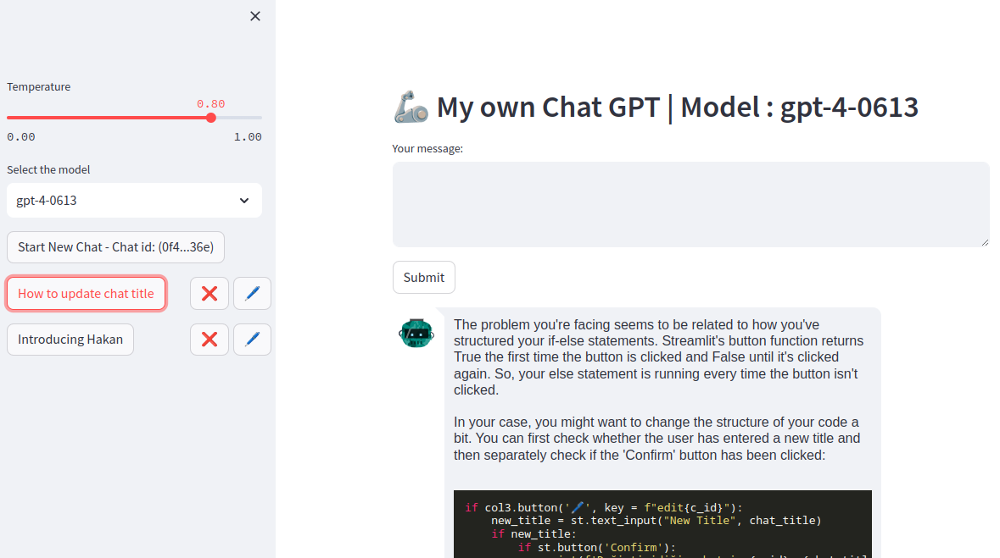

# Custom Chat GPT

Custom Chat GPT is a chatbot application powered by OpenAI's GPT-X language model. It allows users to have interactive conversations with the chatbot and receive AI-generated responses.




## Installation

1. Clone the repository:

git clone https://github.com/cappittall/myGPT4.git


2. Create a virtual environment (optional but recommended):

python -m venv venv


3. Activate the virtual environment:
- For Windows:
  ```
  venv\Scripts\activate
  ```
- For Linux/Mac:
  ```
  source venv/bin/activate
  ```

4. Install the required packages:

pip install -r requirements.txt

## Configuration

1. Rename the `.env.template` file to `.env`.
2. Open the `.env` file and add your OpenAI API key:

    OPENAI_API_KEY=your-api-key


## Usage

To start the chatbot application, run the following command:


`streamlit run mygtp4.py`


Once the application is running, you can access it in your web browser at http://localhost:8501/.

## License

This project is licensed under the MIT License. See the [LICENSE](LICENSE) file for more information.


